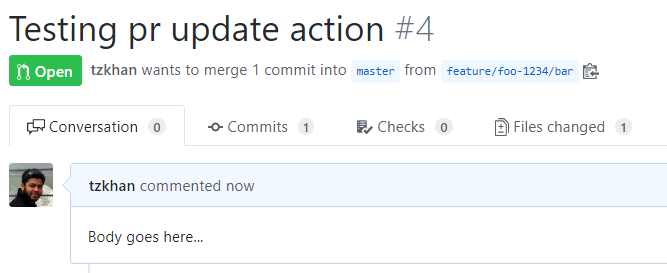
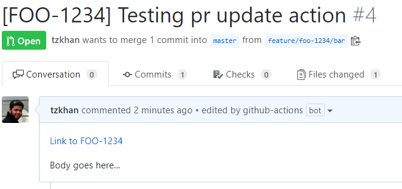

# Pull Request Updater

This is a GitHub Action that updates a pull request with information extracted from branch name. The pull request title and body can either be prefixed or replaced.

## Usage

### Create Workflow

Create a workflow yaml file (eg: `.github/workflows/update-pr.yml` see [Creating a Workflow file](https://help.github.com/en/articles/configuring-a-workflow#creating-a-workflow-file)):

```
name: "Update Pull Request"

on: pull_request

jobs:
  update_pr:
    runs-on: ubuntu-latest
    steps:
    - uses: tzkhan/pr-update-action@v1
      with:
        repo-token: "${{ secrets.GITHUB_TOKEN }}"                   # required - allows the action to make calls to GitHub's rest API
        branch-regex: 'foo-\d+'                                     # required - regex to match text from the head branch name
        lowercase-branch: true                                      # optional - whether to lowercase branch name before matching
        title-template: '[%branch%]'                                # required - text template to update title with
        replace-title: false                                        # optional - whether to prefix or replace title with title-template
        title-prefix-space: true                                    # optional - whether to add a space after title prefix
        uppercase-title: true                                       # optional - whether to uppercase matched branch info in title
        body-template: '[%branch%](https://browse/ticket/%branch%)' # required - text template to prefix body
        replace-body: false                                         # optional - whether to prefix or replace body with body-template
        body-prefix-newline-count: 2                                # optional - number of newlines to insert after body prefix
        uppercase-body: true                                        # optional - whether to uppercase matched branch info in body
```

`body-template` can be set to a GitHub secret if necessary to avoid leaking sensitive data in the URLs for instance. `body-template: ${{ secrets.PR_BODY_PREFIX_TEMPLATE }}`

_**NOTE**: template values must contain the `%branch%` token (can occur multiple times) so that it can be replaced with the matched text from the branch name._

## Example

So the following yaml

```
name: "Update Pull Request"
on: pull_request

jobs:
  pr_update_text:
    runs-on: ubuntu-latest
    steps:
    - uses: tzkhan/pr-update-action@v1
      with:
        repo-token: "${{ secrets.GITHUB_TOKEN }}"
        branch-regex: 'foo-\d+'
        lowercase-branch: false
        title-template: '[%branch%]'
        replace-title: false
        title-prefix-space: true
        uppercase-title: true
        body-template: '[Link to %branch%](https://url/to/browse/ticket/%branch%)'
        replace-body: false
        body-prefix-newline-count: 2
        uppercase-body: true
```

produces this effect... :point_down:

#### before:


#### after:

